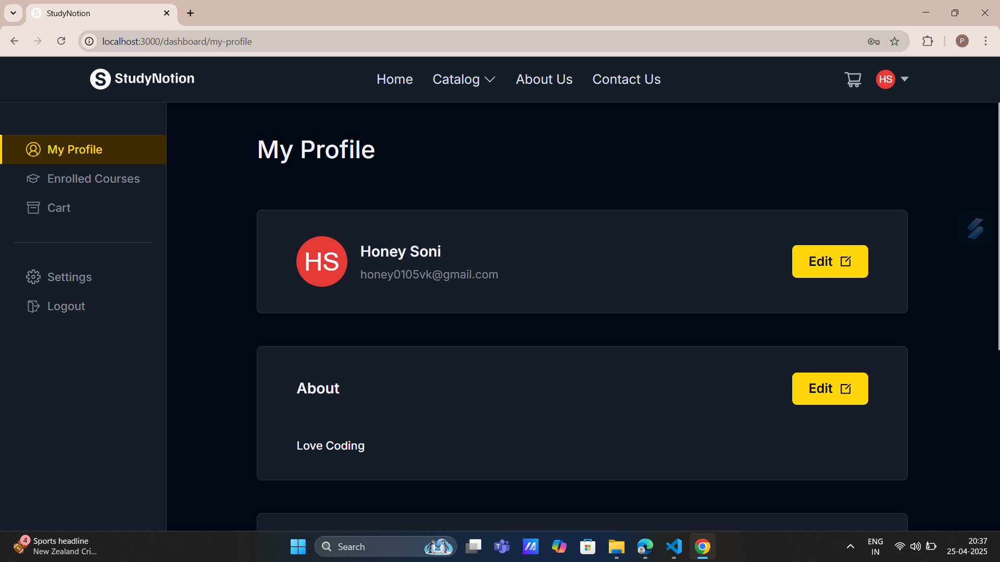

# EdTech Platform

StudyNotion is an advanced and comprehensive ed-tech platform that empowers users to seamlessly create, consume, and evaluate a wide range of educational content. Developed using the powerful and dynamic MERN stack, the platform leverages the collective strengths of ReactJS, NodeJS, MongoDB, and ExpressJS to deliver an intuitive, robust, and fully functional experience for both educators and learners alike. It is a versatile and intuitive ed-tech platform that is designed to provide an immersive learning experience to students and a platform for instructors to showcase their expertise.

[](LICENSE.txt)

## 🚀 Features

- 👨‍🏫 Instructor dashboard to create and manage courses
- 🎓 Student dashboard to enroll in and track course progress
- 🧠 Course video/content upload and access
- 📚 Categorized course listing and search
- 🔐 Authentication & Authorization (JWT-based)
- 🗂️ Admin panel (optional) for user and content moderation

## 🛠️ Tech Stack

**Frontend:**
- React.js 18+
- Tailwind CSS 3+
- React Router 6+

**Backend:**
- Node.js 16+
- Express.js 4+
- MongoDB 6+ (with Mongoose ODM)

**Authentication:**
- JWT
- bcrypt.js

**Utilities:**
- Multer (file uploads)
- Axios (HTTP client)
- Concurrently (dev server)


### Prerequisites

- Node.js
- MongoDB (local or Atlas)
- Postman(for API Testing)
- VS Code


> _Knowledge of JavaScript, React, Node.js, Express, and MongoDB will be helpful._

### Screenshots

### HOME PAGE 


### LOGIN/SIGNUP PAGE


### INSTRUCTOR VIEW


### STUDENT VIEW



## 📜 License

This project is licensed under the MIT License - see the [LICENSE](LICENSE.txt) file for details.

### Installation

### 1. Clone the repository:

```bash
git clone https://github.com/PriyanshuSoni01/edtech-platform.git
cd edtech-platform

###  2.Backend Setup:
cd backend
npm install
cp .env.example .env
# Configure your .env file

###  3.Frontend Setup:
cd ../frontend
npm install

###  4.Run both Frotend and Backend using Concurrently Package 
npm i concurrently

# ADD SCRIPT:
    "server": "cd ../Backend && npm run dev",
    "dev": "concurrently -n \"Frontend,Backend\" -c \"bgBlue,bgYellow\" \"npm start\" \"npm run server\""

###  5.RUN the project
npm run dev

### Live Demo

-> The project is currently under development. The deployed link will be added here once it's live._

